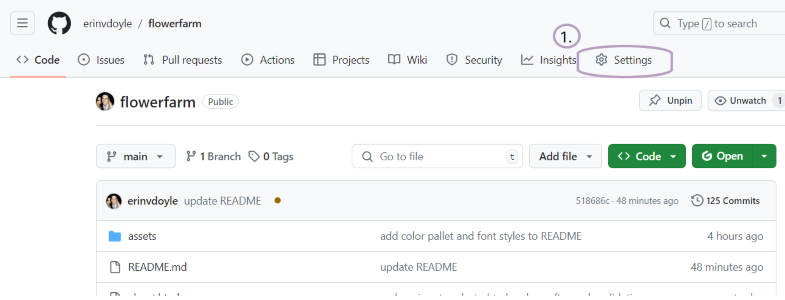

# Welcome to Black Sheep Farm

  

## Introduction

The Black Sheep Farm website invites its visitors to connect with nature. This flower farm and events venue is set in the Wicklow Mountains of Ireland and offers a variety of outdoor activities and purposes: Garden walks, weekend yoga, floral design classes, a cut flower garden to build and bring home a bouquet, and an event space to host special occasions.

Users of the site will find out about the owners of the farm and their origin story, as well as a mission statement for the "why" behind the farm, as found in the Our Story (about) page. All of the information to either plan a day visit or inquire about booking the farm is contained within the Events and Visit pages. There is a class schedule newsletter to subscribe to and a contact form for events. The site is intended for adults, their family memebers, and friends of all ages and backgrounds; anyone who would enjoy spending time in a garden setting.

## Table of Contents
- [Why Black Sheep Farm?](#why-black-sheep-farm)
- [UX Design](#uxdesign)
- [Features](#features)
- [Future Features](#futurefeatures)
- [Testing](#testing)
- [Deployment](#deployment)
- [Languages](#languages)
- [Credits](#credits)
- [Bugs](#bugs)

## Why Black Sheep Farm? 
We were tasked for our first project with Code Institute to build a site with a minimum of three pages. I wanted to create something I felt passionate about, so I chose to create this site and name it so as in a different life, my home and the nature preserve around it could be Black Sheep Farm. 

Because a wellness website was one of our project prompts, I gave the business a focus on slow-living, sustainability, and spending time outdoors. This lent itself to the plant and floral-based color palette and the style choices made along the way. Sometimes we need to stop and take a breath, feel the sun on our faces, listen to birdsong, and appreciate the beauty around us; if this site can evoke that sense, or better yet, encourage its viewer to do so, then it has been successful. Every project is a journey in itself, and on this one, I gathered visual inspiration from nature and natural photography and let the design of the site follow organically.

## UX Design
Inspiration for the design began with a photo of a field of dahlias and the building of wireframes via Balsamiq. 

The 5 Planes of UX Design guided this process:

1. STRATEGY -
   To achieve a visually pleasing web experience that evokes a connection to nature and invites its visitors to plan either a day or an event out at the farm.

2. SCOPE -
   - i.  An enticing landing page witha simple layout that displays the beauty of the farm's flowers while inviting visitors to explore the site.
   - ii. A feel good origin story about literal and metaphorical black sheep and a mission statement to connect with the reader.
   - iii. Visit and Events pages to display what the farm offers.

3. STRUCTURE -
   Four pages with clear purposes. Landing, About (titled "Our Story"), Visit, and Events.

4. SKELETON -
   Planned and assembled in wireframes

  <Balsamiq Wireframes>

5. SURFACE - 
   A color palette based off of floral hues for images and feature elements and a neutral grey background to tie into the logo and farm name. Flip cards representing each page of the site are used on the landing page for visual interest. Images from the farm are used for the front of the cards and brief explanatory text with a link to the page described reveal on hover. Background colors on the back of the cards were taken from the front images using a color picker. The form and email subscription signup are each overlaid atop a background image representing life at the farm. Dark grey text is used in favor of black for ease of reading. Copy and image choice give the site an informal, friendly, homespun feel.

  - Fonts and Colors
    - Fonts courtesy of Google Fonts. "Sail" for headers and accent text; "Source Sans 3" for all other copy:
    

    
    
    

    - Colors:
    

    
    
    

    -  Hex codes:
      - C7C6C6, Silver
      - 444141, Jet
      - CAA8A9, Rosy Brown
      - E9DBA5, Vanilla
      - E7DADE, Lavendar Blush
      - EDBC80, Buff
      - 9BAAA1, Ash Gray
      - DCC8BF, Pale Dogwood
   
## Features   
### Header and Navigation

  - The header is in a fixed position and remains static at the top of the page.
  - The navigation element features at the top of each page, inside the header where the logo and name are located on the left side. These are clickable and return the user from any page or position on the site to the landing page. 
  
  

    
  

  - For mobile screens, the right side features a toggle bar which opens a menu. When clicked, it displays links to the four pages: Home, Our Story, Visit, and Events.
  - For tablet-sized screens and larger, this toggle gives way to links to the four pages. 

### Index.html

  
  - The landing page features a hero image with one of the farm's mascots at the forefront: A black sheep. Cover text at the bottom of the image lists the farm's full name.
  - Beneath the hero image and cover text, four flip cards introduce the three remaining pages and a coming soon feature: A bouquet box. The front of these cards show an image relevant to the page content (Dahlias for Our Story/about, a garden pathway for Visit, and a decorated table for Events). These cards flip using the CSS transform property. The brightly colored back side of each card contains a short explanation of each page and a link.

  

  
  

### Our Story (about.html)

  

  
  

  - This about page features a newspaper-like format with four images sized to echo the landing page's flipcards. The main content is split into two containers: The left side contains the images and a brief introduction, while the right side contains text about the owners and their vision for the farm. The background colors are an earthy pale peach and a muted sage green to give the page a calming, homey feel appropriate to the content. 

### Visit.html 

  

  
  

  - The Visit page contains a call to subscribe to the class schedule. The input box and a description of the classes offered is overlayed on a background image of a bouquet being arranged. The right half of the screen displays four images with border and padding such that they appear in the style of polaroid photographs. Each image is captioned to describe the class or farm attraction they depict: Garden yoga, floral arrangement, family-friendly garden walks, and the on-site cafe. These image cards flip on hover to reveal the class times and locations.

  

    
  

### Events.html

  - This page introduces the different opportunities to book the farm as the venue for a special occasion. There is a hero image of an events table, text below it to detail types of events, and an image with a contact form overlayed so that users can get in touch with the owners about scheduling an event.

### Footer

  - The footer houses four icons spaced evenly across the bottom of the page. These icons link to Black Sheep Farm's social media: Facebook, X, Instagram, and Youtube.

- Site Consistency
  - Neutral and complimentary floral colors paired with uniformly sized, round-edged images are used to create a cohesive feel. Each page features either a hero image with text beneath, a split screen style format, or a combination of both, to maintain consistency. Flip cards are used to add interest to images on two of the pages.

## Future Feature Developments
- Bouquet CSA: A sign up and info page for a monthly subscription bouquet box (as shown on flipcard #4 on the landing page).
- Flowers: A feature page with images of each garden and the varieties of flowers grown.
- A dynamic bi-weekly calendar on the Visit page to view and reserve a spot for upcoming classes. 
- A scrolling or dynamic image gallery of events.
- "LambCam": Livestream video of the farm's lambs.
- Streamable content: Yoga and meditation classes for non-local visitors and an audio gallery of Black Sheep Farm nature sounds, forrest bathing, etc.

## Deployment
- This site was deployed through GitHub repository [/erinvdoyle/flowerfarm](https://github.com/erinvdoyle/flowerfarm)
1. Follow the link above and click the Settings tab in the top navigation bar.
2. From there, navigate to the Code and Automation section on the left side of the screen and click the pages tab.
3. Under the "Build and deployment" header, click the drop down menu "Deploy from a branch," located under Source.
4. Under Branch, select "main" with folder "/root" and click Save.
- Congratulations, your site is now deployed.

 

## Languages
- HTML5
- CSS

## Credits
- Content 
  - Flip Card tutorial from W3Schools [How To Create a Flip Card with CSS](https://www.w3schools.com/howto/howto_css_flip_card.asp)
  - Ribbon tutorial from W3Schools [How To Create a Ribbon with CSS](https://www.w3schools.com/howto/howto_css_ribbon.asp)
  - Adding a form to an image W3Schools [How To Add a Form to an Image](https://www.w3schools.com/howto/howto_css_form_on_image.asp)
  - Footer tutorial from FreeCodeCamp [How to keep your footer where it belongs](https://www.freecodecamp.org/news/how-to-keep-your-footer-where-it-belongs-59c6aa05c59c/)
  - README Tutorial on Medium [How to make the perfect README.MD on Github](https://medium.com/swlh/how-to-make-the-perfect-readme-md-on-github-92ed5771c061)

- Media
  - Logo Icon from [Icons8](https://icons8.com)
  - Web Fonts "Sail" and "Source Sans 3" from [Google Fonts](https://fonts.google.com/)
  - [Font Awesome](https://fontawesome.com/) for favicon, burger menu, and social media icons
  - (https://www.imagecolorpicker.com) color picker for background colors inspired by images
  - Images from [freepik](https://www.freepik.com) and [Floret Flowers](https://www.floretflowers.com)
  - [Squoosh](https://squoosh.app/) for image compression
  - [Coolors](https://coolors.co/) for README visual of color pallet

- Guidance
  - Inspiration and a jumping off point from Code Institute's Love Running walkthrough project.
 

## Testing
### Feature testing
- The mobile nav toggle clicks into a drop down navigation menu which covers the width of the screen. Its links deliver the user to the page chosen.

- The landing and Vist pages feature flip cards which function as expected, performing a horizontal flip across the y axis on hover.
  
- The newsletter signup box on the Visit page requires an email address to be entered on submission. The user data is collected and correctly routed to the Code Institute form dump.

- The Events page features a contact form which requires data entered into the top three input fields in order to submit. This functions correctly and sends the data to the Code Institute form dump.

  

### Browser compatibility

| Browser Tested          | Intended Appearance | Intended Responsiveness |
|-------------------------|---------------------|-------------------------|
| Chrome (Mobile/Desktop) | Good                | Good                    |
| Edge (Mobile/ Desktop)  | Good                | Good                    |
| Safari (Mobile)         | Good                | Fair                    |

- The site has been manually tested for desktop with Microsoft Edge and Google Chrome, and for mobile with Edge, Chrome, and Safari. The function and design of the site remain intact with the exception of a bug on Safari mobile on my own personal device, as detailed in the Unsolved Bugs section below.

### Responsiveness 
- All pages have been tested for responsiveness through both Chrome and Edge DevTools at the following CSS breakpoints:
    - Mobile S (320px)
    - Mobile M (375px)
    - Mobile L (425px)
    - Tablet (768px)
    - Laptop (1024px)
    - Laptop (1440px)
  
- Manual testing has been performed on an iPhone 11 and iPhone12 using Safari and Chrome, as well as on three Windows laptops of differing screen sizes. [https://ui.dev/amiresponsive](https://ui.dev/amiresponsive) provided the screenshot for the top of this README and allowed further testing on site. 

### Lighthouse & WAVE testing
- After running an inital Lighthouse test on each page of the site, it was clear that SEO and Accessability needed to improve. I used the WAVE Web Accessability Evaluation Tool to scan each page and found several contrast errors on the landing page flipcards, as well as empty labels in the nav toggle and forms in Visit and Events. The contrast issues were easily modified using WAVE's contrast tab and color sliders. The missing labels were fixed after a quick google search suggested adding aria labels. The final issue to be fixed recurred throughout the site and was a failure to adhere to header best practices. I had understood that headers should be used consecutively in size with no smaller header preceeding a larger one, but did not realize it was bad practice to start a page with an h3, for example, without first having an h1 followed by an h2. I resolved this issue by using font-size percentages in a CSS class for each header. This allowed me to keep my preferred size while using the correct selector. Once these errors and alerts were fixed, Lighthouse testing across mobile and desktop for all four pages resulted in SEO and Accessability scores of 100.

### Code validation
-[HTML Validator](https://validator.w3.org/) - Running the code through an HTML validator highlighted three errors. I used an erroneous img closing tag for the logo image, which occurred across all pages as they shared the same header. I also attempted to add an alt tag to a section element composed of a background image which was assigned in the css rather than an html image tag. Finally, I used a css ID multiple times for the flipcard text rather than correctly assigning a class. These were all easily fixed by deleting the superfluous code and switching the ID selector to a class.
-[CSS Validator](https://jigsaw.w3.org/css-validator/) - The CSS validator highlighted two specific errors: I attempted to use a negative padding value in the about page and a size value rather than re-size on the nav toggle icon. I removed the unneccesary CSS to resolve these issues.

| W3 Validator | index.html | about.html | visit.html | events.html |
|--------------|------------|------------|------------|-------------|
| html         | Pass       | Pass       | Pass       | Pass        |
| CSS          | Pass       | Pass       | Pass       | Pass        |

## Bugs
- Solved Bugs
  - When I deployed my site, I realized that the header left a gap at the top of the screen which became visible on some mobile devices when the user scrolled. I added a property of "top: 0;" to solve this issue.
  - After testing my deployed site on different screens and devices, I realized the photos were loading slowly. I converted them from jpg to webp to lower the resolution and decrease load time.
  - The form text and content on the Events and Visits pages, as well as the text of the "Our Story" div on the about page, overflowed their containers when tested on mobile device landscape dimensions. Adjusting devtools to the proper dimensions for landscape on small devices was something I neglected to do and I did not catch the bug until testing landscape mode on my own device. I corrected the flex box for each image container and set each form container to 80% width to solve this issue.

- Unsolved Bugs
  - However, as an addendum to my final "solved" bug above, I found that the Events form and the "Our Story" div in the about page function as expected on my mobile phone's Chrome in landscape mode, but overflow their containers on mobile Safari (iphone 12). These elements function properly on all mobile landscape (starting at a height of 320px and upward) in DevTools for Microsoft Edge and Chrome, as well as my partner's safari mobile (iphone 11). 
